# DockerStart - Captures des exercices

Ce README regroupe toutes les captures d'ecran des exercices realises.

## Exercice 1 - job-01

## Exercice 2 - job-02

## Exercice 3 - job-03

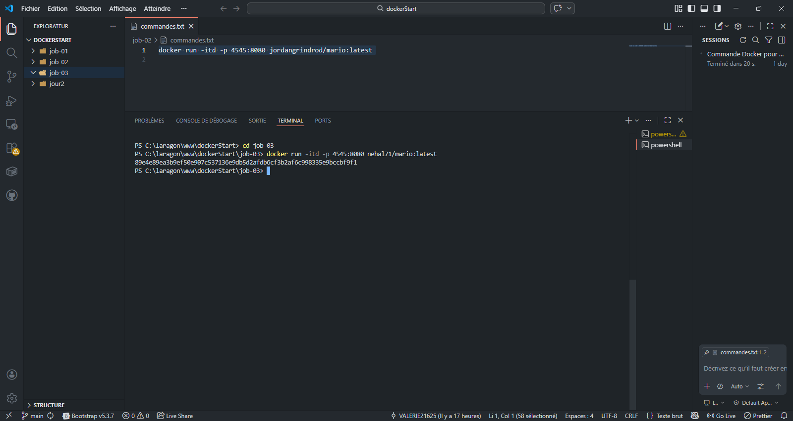
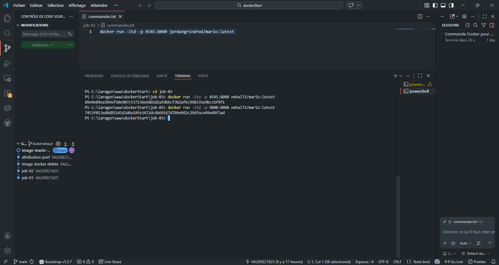
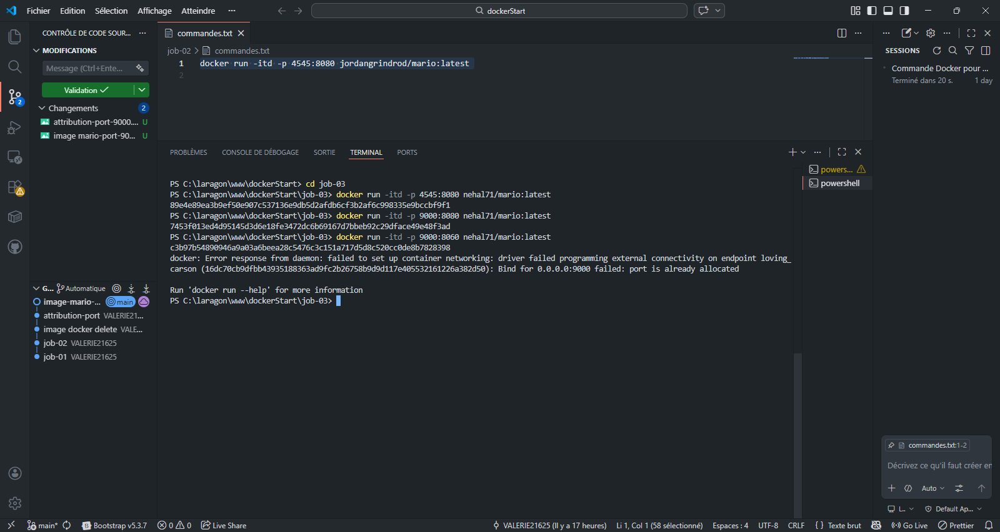

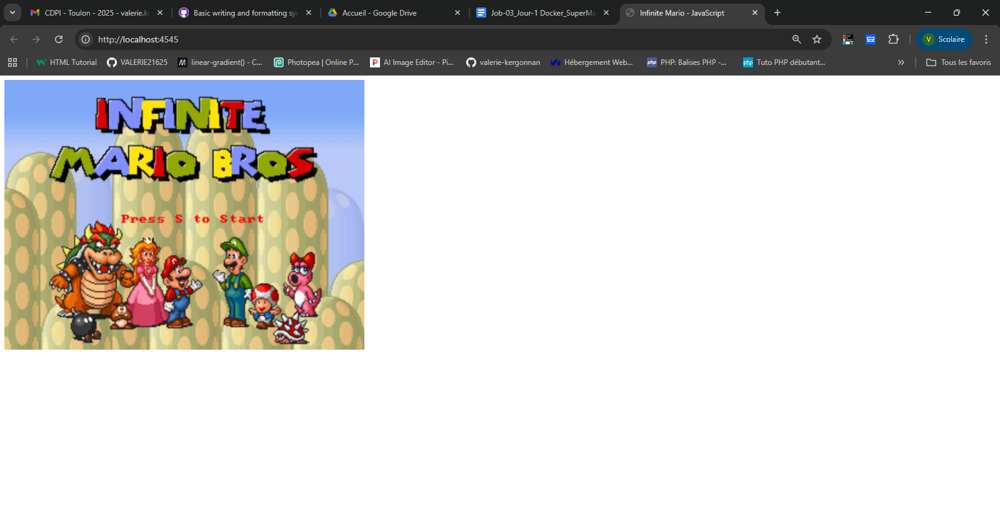
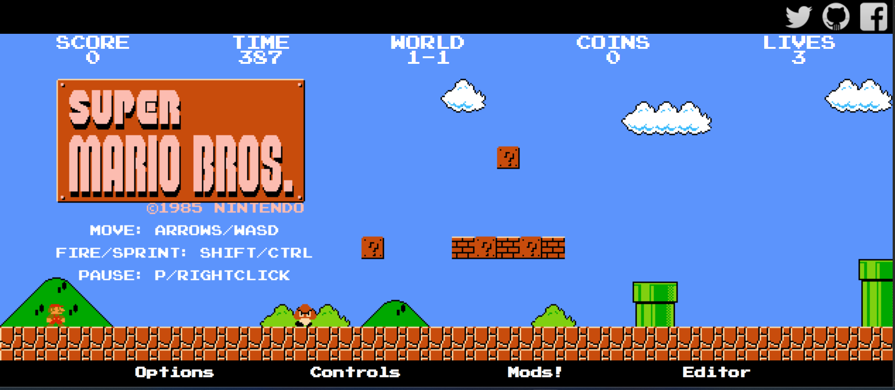
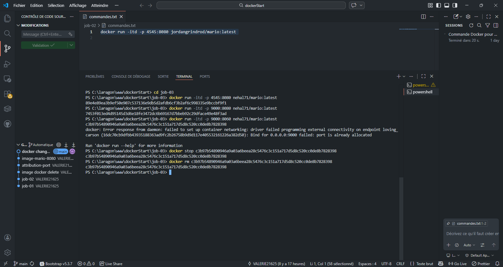

## Exercice 4 - jour2/job-04

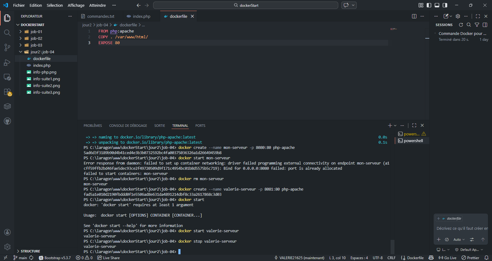
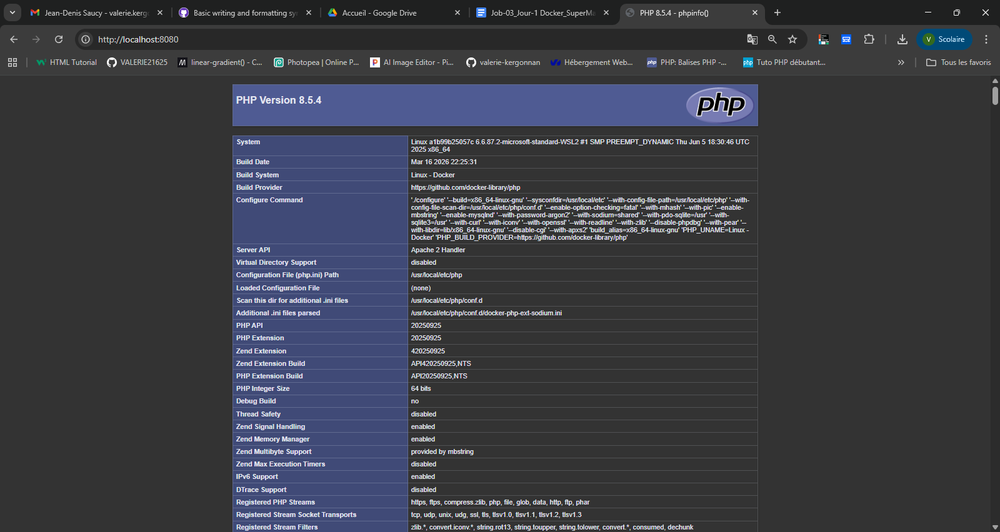
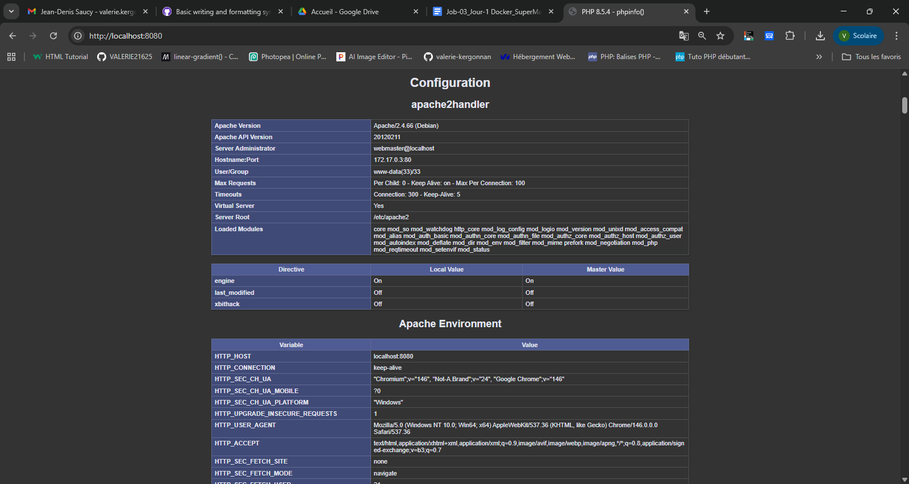
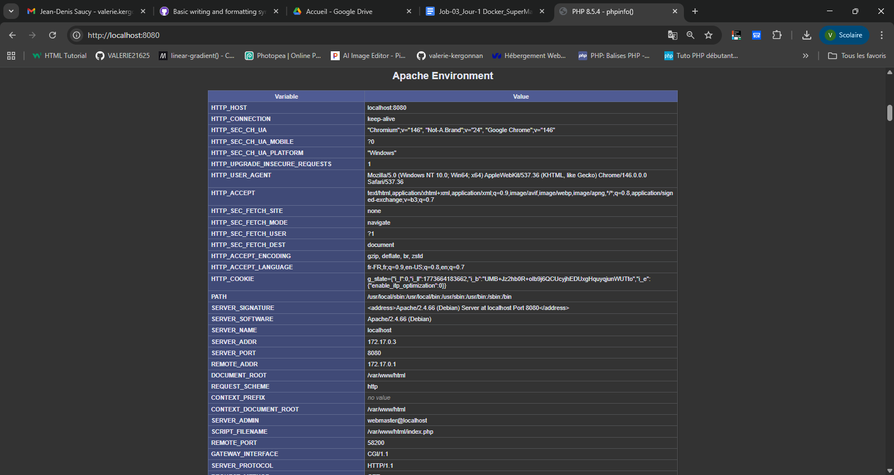
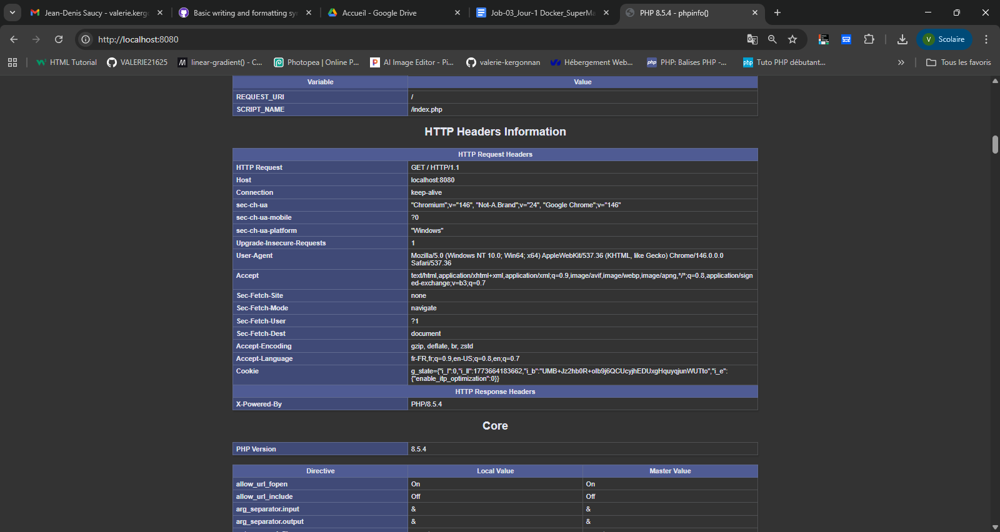

## Exercice 5 - jour2/job-05

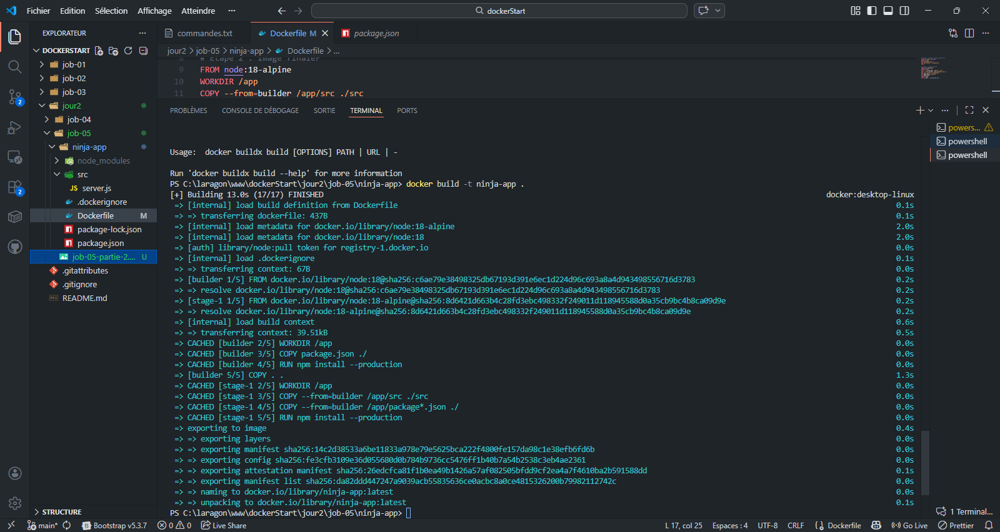
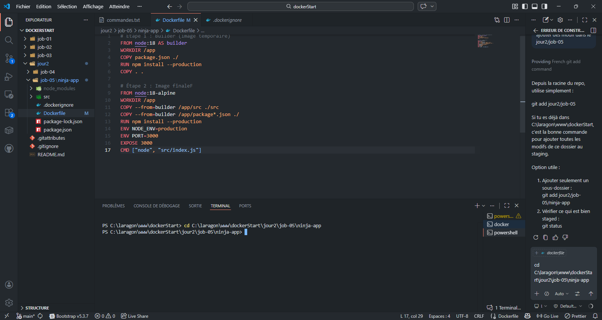
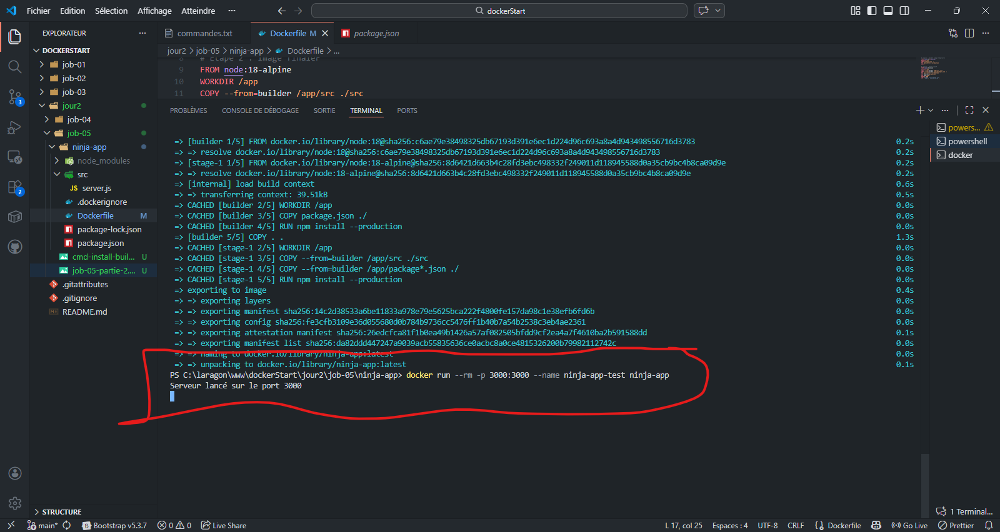
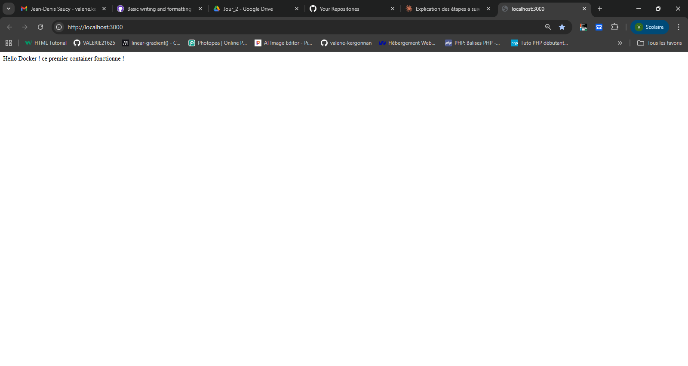

## Exercice 6 - jour2/job-06

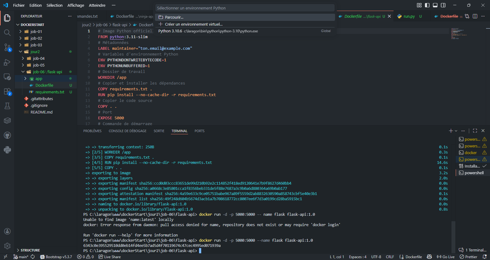
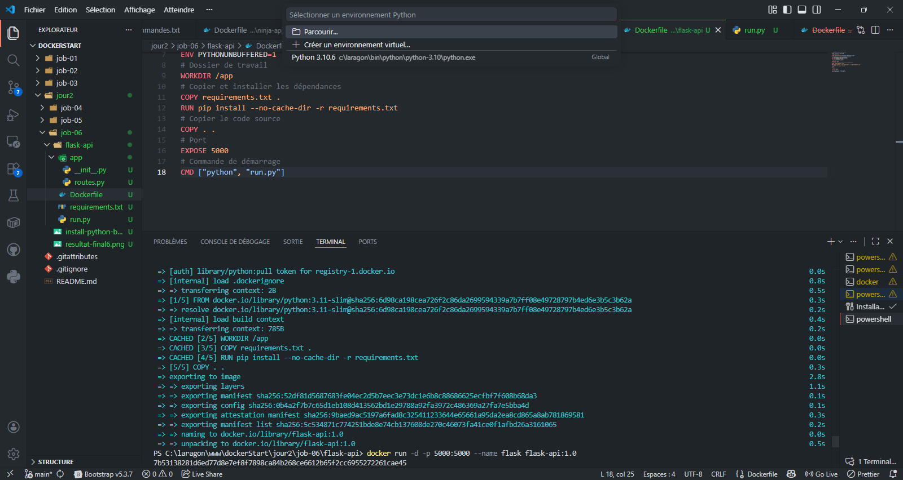
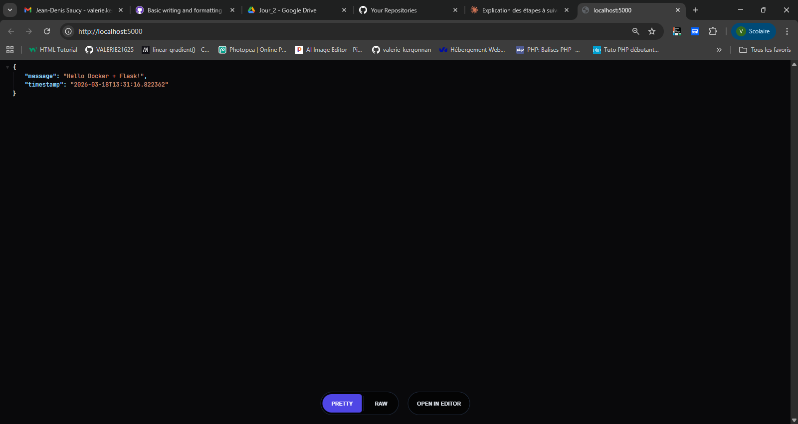

# construire un container 
docker build -t 

# demarrer un container
docker run -d -p 5000:5000 --name flask flask-api:1.0

# stopper le container
docker stop flask

# supprimer le container
docker rm flask
